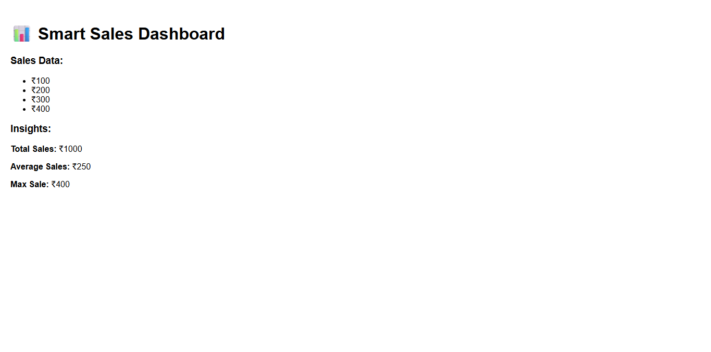

# Smart Sales Dashboard

A simple full-stack application built using React and Node.js that displays sales data and generates insights.

## Features
- Fetch sales data using API
- Calculate total, average, and max sales
- Display insights in UI

## Tech Stack
- React JS
- Node.js
- Express

## Preview

## How to Run
1. Run backend:
   cd backend
   node server.js

2. Run frontend:
   cd frontend
   npm start
